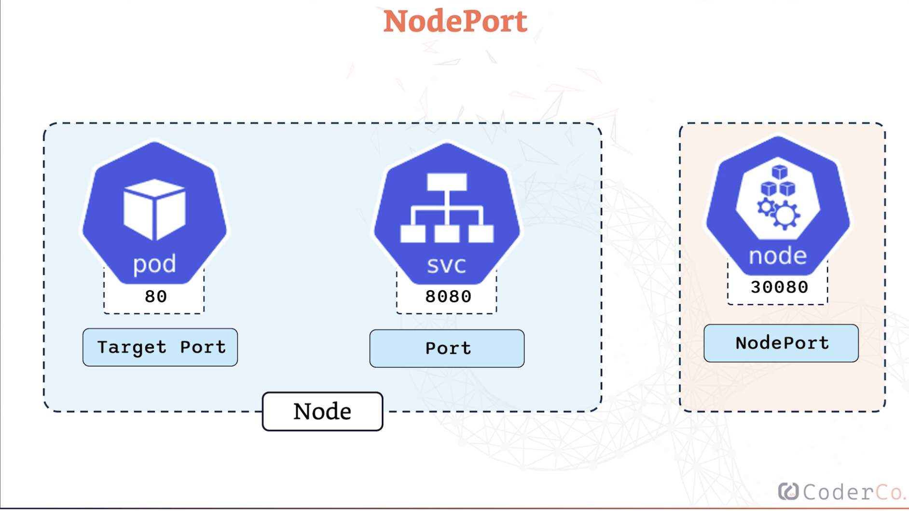

How can we expose our application weve created as pods/deployments onto services so other users can access them?

K8 services are like the connectrions in yourt application

Services allow for seemless connectivity between pods (that are needed to communicate in order to ensure that the application runs smoothly)

Services allow for the connectivity betweeen the groups of pods (backend pods, frontend pods, database pods etc)

How do they identify which pods to connect to each other?
Service suse labels to iderntifgy which pods they should connecting
When you are creating a service, you are telling kubernetes which labels to look for, and automatically links the service to the right pods
making manual connection bewtween different oaprts of your application muich easier

three main types of services:

cluster ip -> gives you a stable internal ip address that your pods can use to talk to each other within the cluster
benefit is security and simplicity
because the service is only accessible within the cluster

keeps your internal communication secure by default

node port -> exposes your service on a specific port on each node in your cluster
to maek sure that a service is accessible from out side the cluster
makes your service accessible outside your cluster

load balancer -> used in cloud environments. creates an external load balacner in your cloud environment that distributes traffic to your pods
