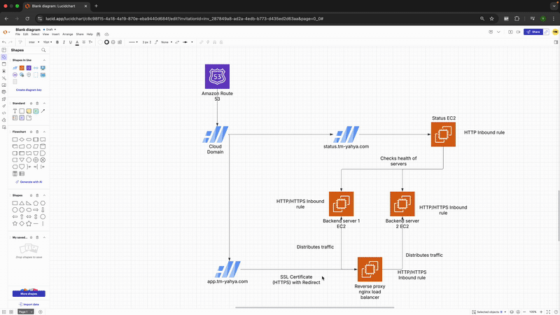

# **High Availability Web Setup with SSL and Reverse Proxy**

## **Objective**

In this project, I set out to build a High Availability (HA) Web Setup with SSL and a Reverse Proxy. The goal was to create a setup that includes:

- Multiple backend servers (VMs) running a simple web app.
- A reverse proxy using NGINX to balance the traffic between the backend servers.
- SSL encryption to secure the connection to the website.
- A health-check system to monitor the status of the backend servers.

---

## **Architecture Overview**

To help visualize the flow of the system, I created an architecture diagram. This architecture showcases the entire setup, from the domain and DNS configuration to the backend servers, the reverse proxy (NGINX), and the status page.


---

## **Step 1: Domain & DNS Setup**

### 1.1 Buying a Domain

I began by purchasing a domain through Cloudflare, but this can be done with other providers like Route53 or Azure DNS. For this setup, I used the domain `tm-yahya.com`.

### 1.2 Creating Subdomains

I created two subdomains for the project:

- **app.tm-yahya.com**: This would point to the Load Balancer (NGINX Reverse Proxy) that distributes traffic between the backend servers.
- **status.tm-yahya.com**: This would point to a separate server that serves the status page, showing the health of the backend servers.

### 1.3 Configuring DNS

I set up the following DNS records:

- **app.tm-yahya.com**: This A record points to the IP of the reverse proxy (NGINX).
- **status.tm-yahya.com**: This A record points to the status page server.

---

## **Step 2: Infrastructure Setup**

### 2.1 Deploying Backend Servers

I deployed two virtual machines (VMs) to act as backend servers. These VMs were simple web servers running NGINX with static HTML pages served from each.

- **Backend Server 1**: This VM hosted a simple static page with a unique message.

  <!--  -->

- **Backend Server 2**: This VM also hosted a static HTML page with a different message to distinguish it from Backend 1.

<!--  -->

### 2.2 Deploying the Reverse Proxy (NGINX Load Balancer)

I then deployed a third VM to serve as the reverse proxy and load balancer using NGINX. Here’s how I set it up:

- **NGINX Installation**: I installed NGINX on this VM and configured it to forward traffic between the two backend servers.
- **Load Balancing Configuration**: I configured NGINX to distribute traffic using a round-robin method to the backend servers. Below is the configuration I used:

```nginx
upstream backend_servers {
    server <Backend-1-private-IP>:80;
    server <Backend-2-private-IP>:80;
}

server {
    listen 80;
    server_name app.tm-yahya.com;

    location / {
        proxy_pass http://backend_servers;
        proxy_set_header Host $host;
        proxy_set_header X-Real-IP $remote_addr;
        proxy_set_header X-Forwarded-For $proxy_add_x_forwarded_for;
    }
}
```

---

## **Step 3: SSL Configuration**

### 3.1 Securing the Connection with Let’s Encrypt

Next, I used Let’s Encrypt to secure the communication with **app.tm-yahya.com** by installing Certbot on the reverse proxy and generating an SSL certificate:

```bash
sudo certbot --nginx -d app.tm-yahya.com
```

## **Step 4: Status Page & Health Checks**

### 4.1 Deploying the Status Page

I created a simple status page hosted on **status.tm-yahya.com** to display the health of the backend servers. This page runs a script that checks the availability of the backend servers by sending a `curl` request.

### 4.2 Health Check Script

To monitor the backend servers, I wrote a basic health check script (`status_check.sh`) that would run every minute and display the status on the status page:

```bash
#!/bin/bash
BACKEND_1="172.31.81.246"
BACKEND_2="172.31.93.181"

# Check if backends are reachable
STATUS_1=$(curl -s --connect-timeout 2 http://$BACKEND_1 > /dev/null && echo "running" || echo "down")
STATUS_2=$(curl -s --connect-timeout 2 http://$BACKEND_2 > /dev/null && echo "running" || echo "down")

# Determine colors based on status
COLOR_1=$( [[ "$STATUS_1" == "running" ]] && echo "green" || echo "red" )
COLOR_2=$( [[ "$STATUS_2" == "running" ]] && echo "green" || echo "red" )

# Generate HTML file
cat <<EOF > /var/www/html/index.html
<!DOCTYPE html>
<html lang="en">
<head>
    <meta charset="UTF-8">
    <meta name="viewport" content="width=device-width, initial-scale=1.0">
    <title>Status Page</title>
    <style>
        body {
            font-family: Arial, sans-serif;
            text-align: center;
            background-color: #f4f4f4;
            padding: 20px;
        }
        .status-container {
            display: inline-block;
            background: white;
            padding: 20px;
            border-radius: 10px;
            box-shadow: 0px 4px 10px rgba(0, 0, 0, 0.1);
        }
        h1 {
            color: #333;
        }
        .status {
            font-size: 1.5em;
            font-weight: bold;
        }
        .running { color: green; }
        .down { color: red; }
    </style>
    <meta http-equiv="refresh" content="10"> <!-- Refresh every 10 seconds -->
</head>
<body>
    <div class="status-container">
        <h1>Backend Server Health</h1>
        <p class="status">Backend 1 ($BACKEND_1): <span class="$STATUS_1">$STATUS_1</span></p>
        <p class="status">Backend 2 ($BACKEND_2): <span class="$STATUS_2">$STATUS_2</span></p>
    </div>
</body>
</html>
EOF
```

---

<!--  -->

## **Step 5: Optional Bonus Challenge**

### 5.1 High Availability for Reverse Proxy

For added resilience, I made the reverse proxy highly available by setting up a floating IP in AWS. This ensures that if the primary reverse proxy VM fails, the floating IP moves to a secondary proxy VM, minimizing downtime.

Alternatively, I could deploy a second reverse proxy VM and use a load balancer to ensure high availability for the reverse proxy layer.

---

## **Expected Outcomes**

Through this process, I gained experience in:

- **Reverse Proxy and Load Balancer Configuration**: Setting up NGINX to distribute traffic between backend servers.
- **SSL Implementation**: Using Let’s Encrypt to secure communication and redirecting HTTP to HTTPS.
- **Health Monitoring**: Setting up a status page to monitor the health of backend servers.
- **High Availability Setup**: Implementing a floating IP and making the reverse proxy resilient to failure.

---

## **Conclusion**

By completing this project, I have learned a lot about:

- Configuring reverse proxies and load balancing with NGINX.
- Securing a website with SSL encryption using Let’s Encrypt.
- Creating a health-check system to monitor and display the status of backend servers.
- Designing a highly available infrastructure that can handle failures and ensure uptime.

This project has provided hands-on experience with modern cloud infrastructure and web security practices.


